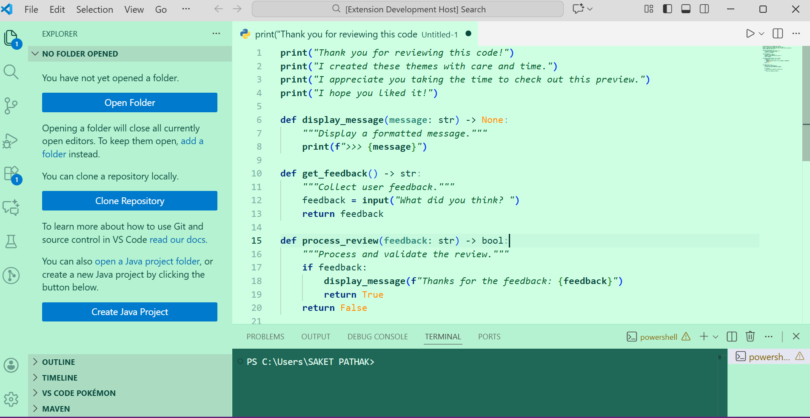
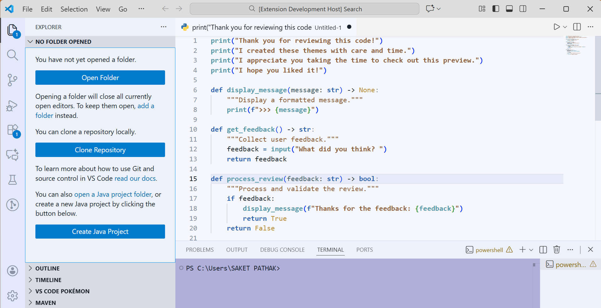
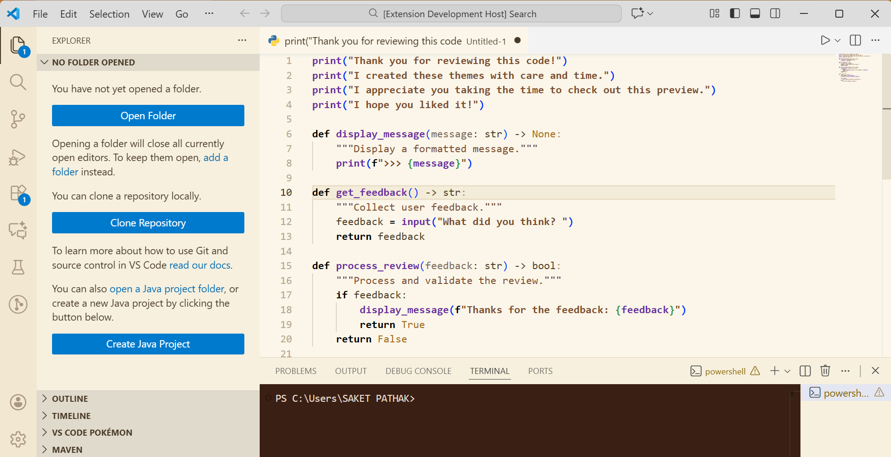
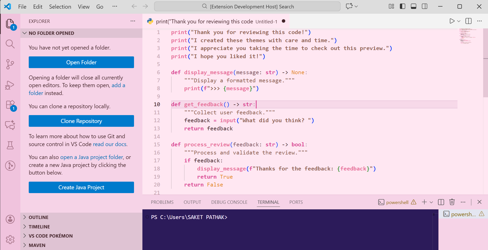
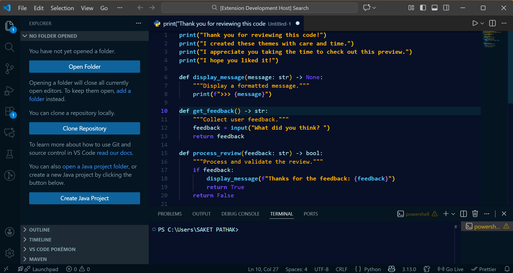
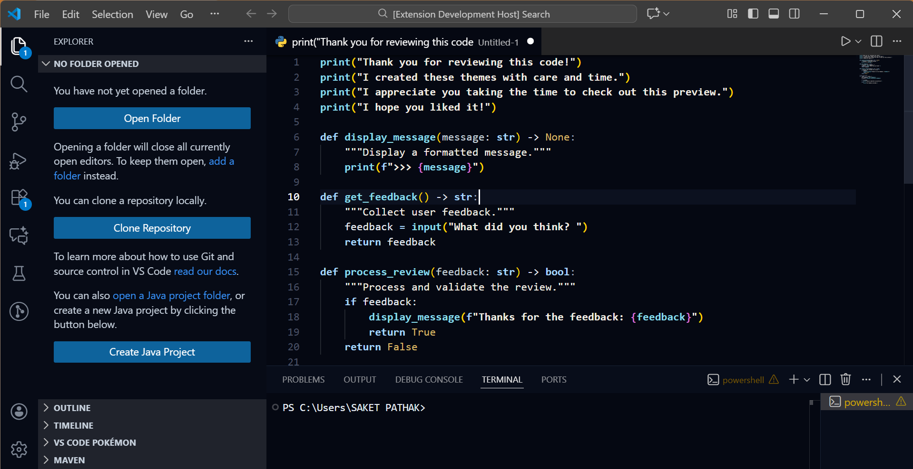
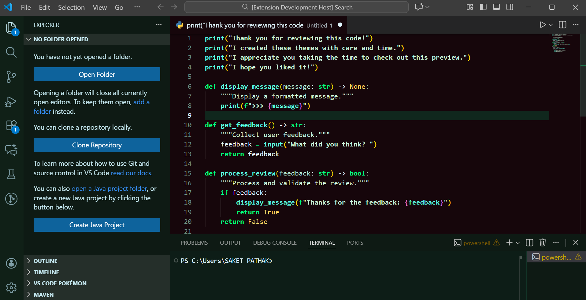
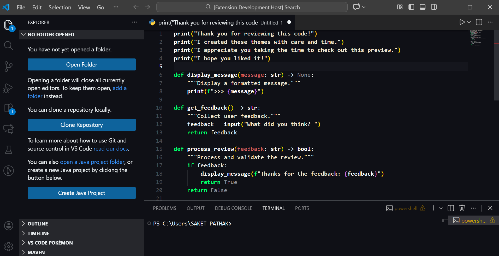
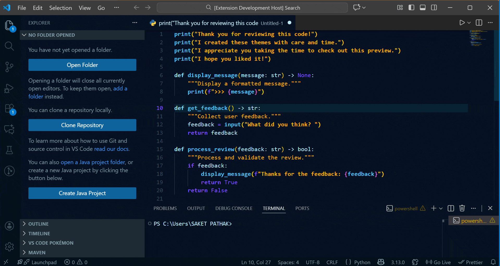

# 🌿 FEELS KINDA ELEGANT — VS CODE THEME PACK

A handcrafted **8-theme VS Code collection** designed for developers who value elegance, focus, calmness, and visual flow.  
With soft, readable light modes and deep, immersive dark modes, this pack enhances both **comfort and concentration** during long coding sessions.

---

## 🏷 Extension Information

| Property | Value |
|----------|--------|
| Publisher | **FunInnate** |
| Developer | **Saket Pathak** |
| Themes Included | **8 total** |
| Modes | Light + Dark |
| License | MIT |
| Category | Themes |
| Versioning | Semantic Versioning (SemVer) |

---

## 🎨 Included Themes

### ☀️ Light Themes
| Theme | Mood | Description |
|--------|---------|------------------------------|
| **Serene Mint** | Refreshing | Calm pastel mint with fresh readability |
| **Sattva** | Peaceful | Minimal and balance-focused with pure clarity |
| **Matte Saffron** | Warm | Earth-tone amber for relaxed visual focus |
| **Lotus Blush** | Gentle | Soft rose-tinted palette for creative thinking |

### 🌙 Dark Themes
| Theme | Mood | Description |
|--------|---------|--------------------------------|
| **Azuryn** | Deep | Oceanic blue glow with cool cyber highlights |
| **Blue Ominence** | Futuristic | Midnight dream-blue ambiance |
| **Emerald Eclipse** | Vivid | Green-neon contrast for visual precision |
| **Verdant Onyx** | Nature-dark | Woodland noir look with natural depth |

---

## 🔠 Recommended Fonts & Pairing

| Theme | Best Match Font | Alternate Choices | Ideal Feel |
|--------|------------------------|---------------------------|----------------------------|
| Serene Mint | Fira Code | IBM Plex Mono | Clean & refreshing |
| Sattva | Iosevka | Recursive | Minimal & mindful |
| Matte Saffron | Cascadia Code | Source Code Pro | Warm & focused |
| Lotus Blush | JetBrains Mono | Operator Mono | Creative & elegant |
| Azuryn | Monaspace Neon | Space Mono | Digital / aquatic |
| Blue Ominence | Hack | Fantasque Sans Mono | Late-night deep work |
| Emerald Eclipse | JetBrains Mono | Victor Mono | Sharp neon clarity |
| Verdant Onyx | Monaspace Argon | Ubuntu Mono | Natural long sessions |

> Enable `"editor.fontLigatures": true` for supported fonts.

---

## 📸 Theme Preview Gallery

### ☀️ Light Mode

| Serene Mint | Sattva | Matte Saffron |
|-------------|--------|----------------|
|  |  |  |

| Lotus Blush |
|-------------|
|  |

---

### 🌙 Dark Mode

| Azuryn | Blue Ominence | Emerald Eclipse |
|--------|----------------|------------------|
|  |  |  |

| Verdant Onyx |
|--------------|
|  |

---

## 🎞 Animated Theme Carousel

> Fast visual demonstration of all variants



---

## 🚀 Installation

1️⃣ Open **Extensions** sidebar: `Ctrl + Shift + X`  
2️⃣ Search **Feels Kinda Elegant**  
3️⃣ Click **Install**  
4️⃣ Change theme → `Ctrl + K`, then `Ctrl + T`  
5️⃣ Pick your preferred variant & enjoy coding  

---

## ⚙ Recommended VS Code Settings

```json
{
  "editor.fontLigatures": true,
  "editor.lineHeight": 1.35,
  "editor.cursorSmoothCaretAnimation": "on",
  "editor.bracketPairColorization.enabled": true,
  "workbench.statusBar.visible": true
}
